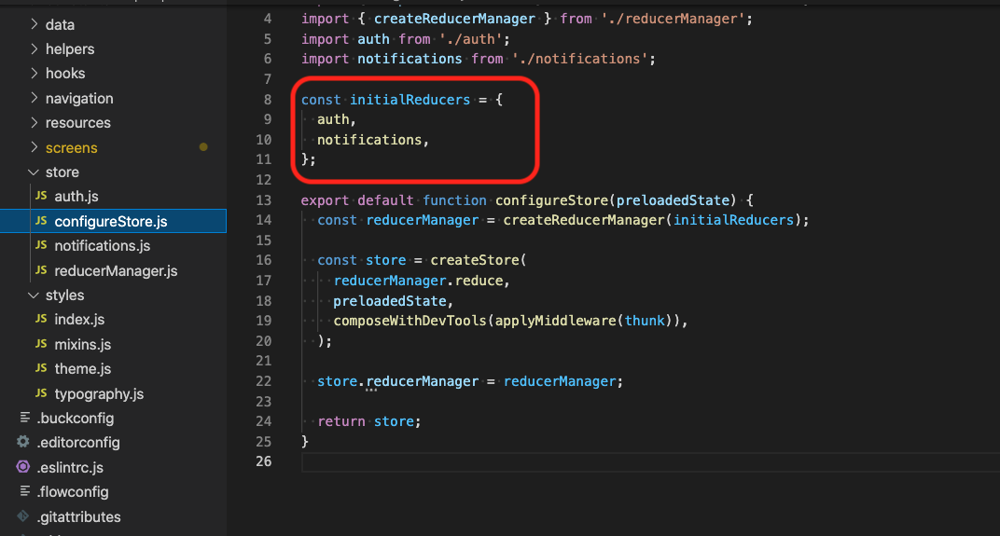

# Dhaval React native Code

## This project is built with [React Native](https://reactnative.dev/)

#### ====> macOS requirements:

**_It is recommended to use [Homebrew](https://brew.sh/) for installing_**

##### 1. iOS:

> - node
> - watchman
> - cocoapods
> - Xcode

##### 2. Android:

> - node
> - watchman
> - cocoapods
> - JDK (Java Development Kit)
> - Android Studio
> - Android SDK

#### ====> Linux requirements:

- ##### Android:
  > - node
  > - watchman
  > - JDK (Java Development Kit)
  > - Android Studio
  > - Android SDK

###### References:

- https://medium.com/@randerson112358/setup-react-native-environment-for-ios-97bf7faadf77
- https://reactnative.dev/docs/environment-setup (Official Documentation for environment setup)

## Running the APP :runner:

- #### Go to `scripts` section inside `package.json` file to see available commands

## Additional instructions to `run` and `build`

#### Install node_modules

`npm install`

#### Run iOS

`cd ios`
`pod install`
`react-native run-ios`

#### Run Android

`cd android`
`gradlew clean`
`cd ..`
`react-native run-android`

## macOS Android installDebug build error fix

1. find your Java JDK home (usually in /Library/Java/JavaVirtualMachines/ )
2. export JAVA_HOME path using: export JAVA_HOME="<your path>"

## Rename Project

1. `cd "project path"`
2. `npx react-native-rename "put here project name"`
3. With custom Bundle Identifier (Android only. For iOS, please use Xcode)
   `npx react-native-rename "put here project name" -b <bundleIdentifier>`
4. Go to `scripts` section inside `package.json` file and run `clear_cache` script (`watchman watch-del-all && rm -f package-lock.json && rm -rf node_modules && npm install && cd ios && rm -f Podfile.lock && rm -rf Pods && pod install`)
   Reference - https://www.npmjs.com/package/react-native-rename

## Add Custom Fonts

1. Add all the fonts [here](src/assets/fonts)
2. Create react-native.config.js file and add these : [here](react-native.config.js)
3. Fire this command : `react-native link`
   Reference - https://kswanie21.medium.com/custom-fonts-in-react-native-tutorial-for-ios-android-76ceeaa0eb78

## Use SVG as component

1. Here are the steps for integration and how to use it - https://www.npmjs.com/package/react-native-svg#use-with-svg-files
2. Add the .svg files in assets/ and use it as component directly.

## Define the coding standards

1. Navigation component - It's contains AppNavigator and AuthNavigator. In AuthNavigator flow contains authentication related screen flow and AppNavigator It's contains application remaining screen flow (features) after login. [Check here](src/navigation/index.js)
2. How to create new reducers - Create new redux file inside [store folder](src/store) and declare it in [configureStore file.](src/store/configureStore.js) 
3. Coding standard
   
   
4. Theme or Global Component - Need to use the [Block Component](src/components/utilities/Block.js) instead of [View](https://reactnative.dev/docs/view) and [Text component](src/components/utilities/Text.js) instead of [Text](https://reactnative.dev/docs/text)
5. [Global Theme Styles](src/styles/theme.js)

## Folder wise description

1. assets - contains all the font family files, png and svg files.
2. components - contains all the components that can be used across multiple screens.
3. config - contains the environment level details and configuration.
4. constants - contains all API list and global links that can be used across multiple screens.
5. data - contains static portion of content in the application.
6. helpers - having all the shared and helper files for the whole application.
7. hooks - Global level function calls for the whole application.
8. navigation - has the code related to navigation across the application.
9. resources - has the one time configuartion, like APIs call.
10. screens - all the screens and parent components are placed in this folder.
11. store - has the one time configuartion related and dispatches actions to the redux store.
12. styles - Global level style sheet for the whole application.

## Code Formatter

1. Install the Prettier (https://marketplace.visualstudio.com/items?itemName=esbenp.prettier-vscode) and ESLint (https://marketplace.visualstudio.com/items?itemName=dbaeumer.vscode-eslint) VS Code plugin.
2. Open the Command Palette (under the View submenu, or using Cmd+Shift+P on Mac and Ctrl+Shift+P on Windows). Then select "Extensions: Install Extensions". (Reference - https://www.codereadability.com/automated-code-formatting-with-prettier/)
3. Search for "Prettier" or "ESLint", click "Install", and then "Reload" once the installation is complete.
4. Set default formatter by these steps : Right click on any .js file --> Format Document With... --> Configure Default Formatter... --> "Prettier - Code formatter"
5. Format document or selection lines : Right click on .js file --> Format Document or Format Selection.
6. Optional - To automatically format the file on saving - https://levelup.gitconnected.com/automatically-format-code-in-visual-studio-code-when-working-with-react-c48674a12dc5
